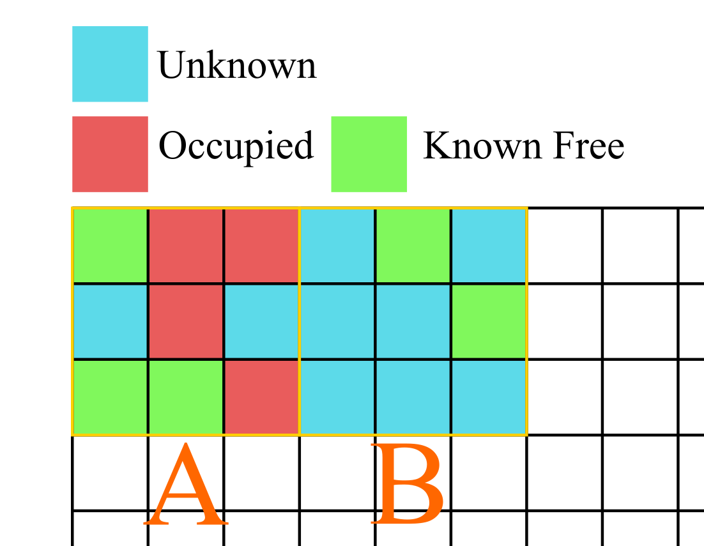

# ROG-Map

# Frontier Generation
当一个格子从unknown变成free的时候，这个格子的26个邻居格子中所有的unk就会被加入到frontier。因此实现在missUpdate函数中。
当一个格子从unk变成其他格子的时候，frontier属性就自动消失了。
当一个格子从free变成其他格子的时候，可能导致他周围的frontier属性消失。
所以应该有一个free_neighbor_cnt物理意义是计算这个格子周围有多少个knwonfree格子，如果这个值为0，那么这个格子就不是frontier了。


# ROG-Map Query

ROGMap的访问仅限于使用三维连续坐标pos。对于两张地图，分别提供了基于GridType的询问和基于是否的询问。此外用户也可以通过外部函数控制地图的滑动情况。

注意！由于膨胀地图有歧义，getInfGridType现在做出如下定义：



* 情况A优先返回Occupied
* 情况B优先返回Unknown
* 如果用户想要想要直到non-occupied的信息，建议使用isOccupied函数。

对于膨胀地图的应用，仍然建议用使用isOccupiedInflate，isUnknownInflate，isFreeInflate等询问式的接口，更加高效一点。

| 函数       | 地图外 | 虚拟天花板和地板外 |      |
| ---------- | ------ | ------------------ | ---- |
| isOccupied | false  | true               |      |
| isUnknown  | true   | false              |      |
| isFree     | false  | false              |      |


## 概率地图

函数原型

```c++
bool isOccupied(const Vec3f &pos) const;
bool isFree(const Vec3f &pos) const;
bool isUnknown(const Vec3f &pos) const;
```


## 膨胀地图

注意，对于所有膨胀地图都是，只要有一个小格子是occupied，则认为这个格子是occupied。在没有occupied的情况下，只要有一个unknown，这个格子就是unknown。

总之，只有一个格子全是knownfree，这个query才会返回knownfree。

```c++
bool isFreeInflate(const Vec3f &pos) const;
bool isOccupiedInflate(const Vec3f &pos) const;
bool isUnknownInflate(const Vec3f &pos) const;
```


# 天花板和地板的处理

已经纠结了好多次了，今天来彻底处理这个问题。首先设置天花板和地板有两个目的

* 屏蔽掉已知环境的地面和天花板点，减少算法的耗时
* 保证飞行的安全。

要保证double型天花板，prob天花板，inf天花板的高度一致。根据格子中心的表达形式，


```c++
GridType getGridType(const Vec3f &pos);
```

返回值包括四种结果

* `OUT_OF_MAP`：表示查询点在局部地图外。
* `UNKNOWN`：表示查询点状态未知
* `KNOWN_FREE`：表示查询点已知安全
* `OCCUPIED`：表示查询点占据，或者高于虚拟天花板，或者低于虚拟地面。


